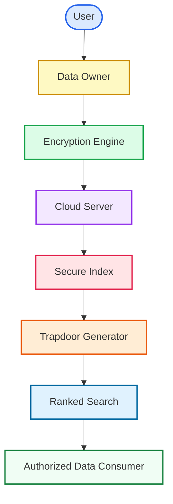

# SecureRank — Secure Ranked Multi-Keyword Search over Encrypted Cloud Data

<p align="center">
  <a href="https://github.com/shyamsunderpolu/Secure-Ranked-Multi-Keyword-Search-System">
    
  </a>
  <a href="https://github.com/shyamsunderpolu/Secure-Ranked-Multi-Keyword-Search-System">
    
  </a>
  <a href="https://github.com/shyamsunderpolu/Secure-Ranked-Multi-Keyword-Search-System">
    
  </a>
  <a href="https://github.com/shyamsunderpolu/Secure-Ranked-Multi-Keyword-Search-System">
    
  </a>
  <a href="https://github.com/shyamsunderpolu/Secure-Ranked-Multi-Keyword-Search-System">
    
  </a>
  <a href="https://github.com/shyamsunderpolu/Secure-Ranked-Multi-Keyword-Search-System">
    
  </a>
  <a href="https://github.com/shyamsunderpolu/Secure-Ranked-Multi-Keyword-Search-System/blob/main/LICENSE">
    
  </a>
  <a href="https://github.com/shyamsunderpolu/Secure-Ranked-Multi-Keyword-Search-System/commits/main">
    
  </a>
</p>

**SecureRank Cloud** is an enterprise-grade cloud security platform that allows organizations to upload encrypted files to the cloud and perform multi-keyword search queries safely without decrypting the data.

---

## 📖 Table of Contents
1. [Project Overview](#1-project-overview)
2. [Problem Statement](#2-problem-statement)
3. [Features](#3-features)
4. [Tech Stack](#4-tech-stack)
5. [System Architecture](#5-system-architecture)
6. [Workflow](#6-workflow)
7. [Folder Structure](#7-folder-structure)
8. [Installation & Setup](#8-installation--setup)
9. [Database Setup](#9-database-setup)
10. [Security Features](#10-security-features)
11. [Screenshots](#11-screenshots)
12. [Future Improvements](#12-future-improvements)
13. [Author](#13-author)

---

## 1. Project Overview

SecureRank is a zero-trust search engine designed for secure cloud storage. 
* It encrypts sensitive documents locally before uploading them.
* It extracts keywords and creates a secure mathematical index.
* It allows users to search through the encrypted database using secure "trapdoor" keys.
* The cloud server ranks the search results by relevance without ever reading the files or knowing what terms were searched.

---

## 2. Problem Statement

Uploading raw text files to public cloud servers risks data leaks and regulatory compliance violations. However, standard database encryption blocks search features, forcing users to download and decrypt entire datasets just to find a single file. SecureRank resolves this by enabling relevance-sorted searches directly on ciphertext.

---

## 3. Features

* 🔐 **Local Encryption:** Encrypts files on your computer using Goldwasser-Micali encryption before they go to the cloud.
* 🔍 **Multi-Keyword Search:** Search for multiple terms in one query without revealing the search words.
* 📈 **TF-IDF Relevance Ranking:** Returns search matches sorted by relevance without decrypting any data on the server.
* 👥 **Role-Based Access Control:** Separate consoles and actions for Data Owners, Consumers, Key Administrators (PKG), and Cloud Admins.
* 🔬 **Search Auditing:** Employs a Secure Coprocessor validation system to verify that the cloud did not omit search results.
* 🖥️ **Modern Dashboard UI:** Built with sleek light/dark themes, sidebar menus, and interactive tables.

---

## 4. Tech Stack

| Technology | Purpose |
| :--- | :--- |
| **Java (JDK 17)** | Core backend processing, cryptographic math, and security controllers. |
| **JSP** | Serves responsive, dynamic dashboards and landing pages. |
| **Java Servlets** | Handles HTTP requests, maps routes, and transfers files. |
| **JDBC** | Connects the Java application layer to the database. |
| **MySQL Database** | Stores encrypted metadata index vectors, logs, and accounts. |
| **HTML5 / CSS3** | Handles visual styling, layout grids, and dark mode tokens. |
| **JavaScript (ES6)** | Powers table search filters, password strength bars, and dropzones. |
| **Bootstrap 5.3** | Delivers responsive page layouts and elements. |
| **Maven** | Compiles project files and downloads necessary libraries. |
| **Apache Tomcat 9.x** | Hosts and runs the local web application container. |

---

## 5. System Architecture

### System Diagram



### Component Details
* **Data Owner:** Prepares files, computes search keyword weights, and uploads encrypted payloads.
* **Encryption Engine:** Handles mathematical calculations for homomorphic searchable indexes.
* **Cloud Server:** Hosts binary files and processes search queries homomorphically without learning raw keywords.
* **Secure Index:** A database table mapping encrypted document IDs to their search keyword weights.
* **Trapdoor Generator:** Client utility that encrypts search keywords into a trapdoor key.
* **Ranked Search:** Evaluates trapdoors against the index and returns relevant files sorted by score.
* **Data Consumer:** Queries databases using trapdoors, requests decryption keys, and downloads files.

---

## 6. Workflow

1. **Upload:** Data Owner selects a file, inputs search keywords, encrypts the file locally, and uploads it.
2. **Indexing:** A secure index vector is generated for the file using TF-IDF weights.
3. **Query:** Data Consumer encrypts a search term into a secure "trapdoor key" and submits it.
4. **Search:** Cloud Server matches the trapdoor against index files and ranks matches.
5. **Decryption:** Data Consumer obtains approval from the PKG, downloads the file, and decrypts it locally.

---

## 7. Folder Structure

```
SecureRank/
├── DATABASE/
│   └── database.sql              # Database structure and seed logins
├── src/
│   └── main/
│       ├── java/
│       │   └── com/
│       │       ├── dao/          # Database connection and math algorithms (GM, Paillier)
│       │       └── servlets/     # HTTP route request handlers
│       └── webapp/               # Web application files (JSPs, CSS, JS)
│           ├── css/
│           │   └── style.css     # Styling styles and variables
│           ├── js/
│           │   └── theme.js      # Password strength meters and table filters
│           ├── WEB-INF/          # Configuration XML mappings
│           ├── index.jsp         # SaaS Product Landing Page
│           ├── login.jsp         # Split-Screen Login portal
│           ├── register.jsp      # Multi-Step Register Wizard
│           ├── DOUpload.jsp      # Owner File Upload & local encryption console
│           ├── SearchFile.jsp    # Consumer Search & Trapdoor query page
│           └── *Home.jsp         # Dashboard landing pages for different roles
├── pom.xml                       # Maven build configuration
└── README.md                     # Project documentation
```

---

## 8. Installation & Setup

1. **Clone the Repository:**
   ```bash
   git clone https://github.com/shyamsunderreddypolu/Secure-Ranked-Multi-Keyword-Search-System.git
   cd Secure-Ranked-Multi-Keyword-Search-System
   ```

2. **Import into IDE:**
   * Open Eclipse IDE or IntelliJ.
   * Choose **Import** ➔ **Maven** ➔ **Existing Maven Projects** and select the root directory.

3. **Build the WAR File:**
   * Run the compile step via terminal:
     ```bash
     mvn clean package
     ```
   * This creates `target/SecureRank.war`.

4. **Deploy on Tomcat:**
   * Copy `SecureRank.war` into your Tomcat `webapps/` directory and start the server.
   * Visit `http://localhost:8080/SecureRank` in your browser.

---

## 9. Database Setup

1. **Create Database Schema:**
   * Open MySQL Workbench or shell and run:
     ```sql
     CREATE DATABASE securerank_db;
     ```

2. **Import SQL Tables:**
   * Execute the database script:
     ```bash
     mysql -u root -p securerank_db < DATABASE/database.sql
     ```

3. **Configure Database Credentials:**
   * Open [DBConnection.java](file:///c:/Users/polus/eclipse-workspace/SecureRank/src/main/java/com/dao/DBConnection.java) and enter your database credentials:
     ```java
     con = DriverManager.getConnection("jdbc:mysql://localhost:3306/securerank_db", "USERNAME", "PASSWORD");
     ```

<details>
<summary>🔑 View Demo Seed Accounts</summary>

Use these credentials to log in and explore the roles:

* **Cloud Server Admin:** `admin@securerank.com` / `admin123`
* **Data Owner:** `alice@securerank.com` / `Alice@123`
* **Data Consumer:** `bob@securerank.com` / `Bob@123`
* **Private Key Generator (PKG):** `pkg@securerank.com` / `pkg123`
</details>

---

## 10. Security Features

* **Probabilistic GM Encryption:** Asymmetric local encryption that produces completely different ciphertexts even for duplicate files.
* **Paillier Homomorphic Search:** Permits math calculations directly on encrypted index structures without exposing keywords.
* **Search Trapdoors:** Prevents the cloud server from tracking search terms by encrypting query keywords.
* **Secure Key Release:** Decryption keys are issued by the PKG only after verification.

---

## 11. Screenshots

### 🖼️ Landing Page


### 🖼️ Login Portal


### 🖼️ Data Owner Dashboard


### 🖼️ File Cryptography Console


### 🖼️ Search Files Console


### 🖼️ Search Results


### 🖼️ PKG Dashboard


### 🖼️ Cloud Server Dashboard


---

## 12. Future Improvements

* 🚀 **Spring Boot Migration:** Restructure the Servlet backend into standard REST APIs.
* ⚛️ **React Frontend:** Convert the JSP files into a Single Page Application (SPA).
* 🔑 **JWT Security:** Add token-based authentication.
* 🐳 **Dockerization:** Containerize database and application environments.
* 🔎 **Elasticsearch Integration:** Speed up searches over massive datasets.

---

## 13. Author

**POLU SHYAM SUNDER REDDY**
* **Role:** Full Stack Java Developer
* **GitHub:** [@shyamsunderpolu](https://github.com/shyamsunderpolu)
* **LinkedIn:** [Polu Shyam Sunder Reddy](https://www.linkedin.com/in/polushyamsunderreddy)
* **Email:** [polushyamsunderreddy@gmail.com](mailto:polushyamsunderreddy@gmail.com)
* **Portfolio:** [Portfolio Website](https://shyamsunderpolu.github.io)
