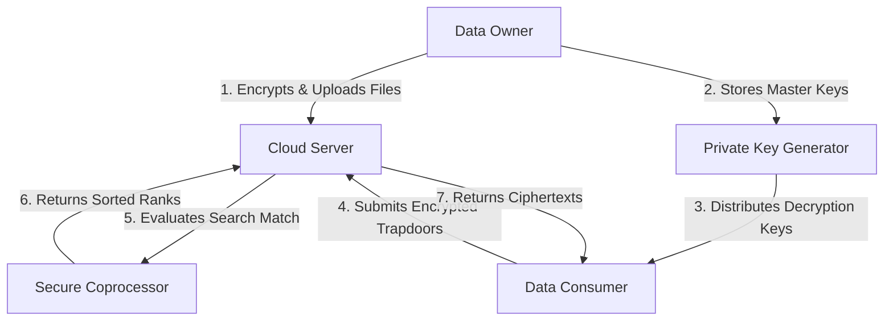

# SecureRank — Secure Ranked Multi-Keyword Search System over Encrypted Cloud Data

<p align="center">
  
  
  
  
  
  
  
  
</p>

**SecureRank Cloud** is a production-ready, enterprise-grade cloud security web application. It implements searchable homomorphic encryption protocols, enabling organizations to outsource sensitive datasets to third-party cloud storage providers while maintaining robust search and data retrieval capabilities. The platform evaluates multi-keyword search queries and ranks documents on the server side entirely inside ciphertext domains, guaranteeing zero-knowledge data privacy.

---

## 📖 Table of Contents
1. [Project Overview](#1-project-overview)
2. [Key Features](#2-key-features)
3. [Architecture](#3-architecture)
4. [System Workflow](#4-system-workflow)
5. [Screenshots](#5-screenshots)
6. [Technology Stack](#6-technology-stack)
7. [Folder Structure](#7-folder-structure)
8. [Installation Guide](#8-installation-guide)
9. [Configuration](#9-configuration)
10. [User Roles](#10-user-roles)
11. [Security Features](#11-security-features)
12. [Performance Highlights](#12-performance-highlights)
13. [Future Enhancements](#13-future-enhancements)
14. [Learning Outcomes](#14-learning-outcomes)
15. [Project Highlights](#15-project-highlights)
16. [Contributing](#16-contributing)
17. [License](#17-license)
18. [Author](#18-author)
19. [Acknowledgements](#19-acknowledgements)

---

## 1. Project Overview

In modern SaaS ecosystems, outsourcing data storage to cloud providers is standard practice. However, storing plaintext files exposes sensitive organizational intellectual property to potential cloud provider leaks or external server breaches.

**SecureRank** addresses this challenge by combining advanced cryptosystems with relevance sorting:
* **Confidentiality:** Documents are encrypted locally using asymmetric probabilistic filters before deployment.
* **Searchable Indexes:** Keywords are extracted and mapped into secure Paillier homomorphic index vectors.
* **Ranked Outputs:** The Cloud Server matches query trapdoors and ranks matching document vectors using TF-IDF weights entirely within the encrypted domain, preventing the cloud from gaining raw plaintext insights.

---

## 2. Key Features

* 🔐 **Secure File Upload:** Encrypts document payloads locally on client runtimes prior to cloud transit.
* 🛡️ **End-to-End Encryption:** Integrates homomorphic mathematical cryptosystems so plaintext is never exposed in memory.
* 🔍 **Multi-Keyword Ranked Search:** Searches multiple keywords in a single query and returns results sorted by relevance.
* 🏷️ **Trapdoor Generation:** Formulates query keywords into secure trapdoor hashes using user secret keys.
* 👥 **Role-Based Access Control:** Delineates operational scopes for Cloud Server Admins, Key Generators, Owners, and Consumers.
* 📦 **Cloud Storage Engine:** Emulates scalable metadata storage schemas suited for high-throughput enterprise databases.
* 🖥️ **Enterprise UI/UX:** Built with sleek light/dark modes, collapsible sidebars, floating alerts, and dynamic loading overlays.
* ⚙️ **Private Key Generator (PKG):** Manages key generation and releases master keys to authorized consumers.
* 🔬 **Search Verification:** The Secure Coprocessor (SCP) audits the search results to detect cloud provider search discrepancies.

---

## 3. Architecture

The system uses a decentralized trust model where private keys are generated by a PKG, index evaluation is handled by the Cloud Server, and verification is checked by the Secure Coprocessor.

### System Diagram



### Component Overview
* **Data Owner:** Performs local preprocessing, extracts keywords, computes Paillier vector weights, and uploads GM-encrypted files.
* **Private Key Generator (PKG):** Trusted root authority responsible for generating public parameter keys and releasing file master keys.
* **Cloud Server:** Hosts binary ciphertexts, evaluates keyword matching filters Homomorphically, and manages the administrative UI console.
* **Data Consumer:** Queries databases using trapdoor hashes and decrypts retrieved files.
* **Secure Coprocessor:** Independent auditor verifying boolean correctness on matching vectors.

---

## 4. System Workflow

```
[Local File Selection] ➔ [Paillier Index Generation] ➔ [Goldwasser-Micali Local Encryption]
                                                                      │
                                                                      ▼
[Authorized DC Decryption] ◄─── [Download WAR] ◄─── [Ranked Match] ◄─ [Upload to Cloud]
```

1. **Owner Setup:** The Data Owner extracts keywords from a document, computes TF-IDF index tables, and homomorphically encrypts the index vectors.
2. **Local Encryption:** The payload is encrypted locally using the Goldwasser-Micali (GM) cryptosystem.
3. **Cloud Deploy:** The GM ciphertext and Paillier encrypted index are uploaded to the Cloud Server.
4. **Trapdoor Formulate:** A Data Consumer generates an encrypted trapdoor for query keywords using their secret key.
5. **Ranked Matching:** The Cloud Server checks the trapdoor against index files homomorphically, calculates relevance scores, and sorts files.
6. **Authorization & Download:** The Data Consumer requests the master key from the PKG. Upon approval, the PKG distributes the decryption key, allowing the consumer to download and decrypt the plaintext document.

---

## 5. Screenshots

### 🖼️ Landing Page
*Placeholder: Landing Page interface displaying SaaS cybersecurity banner and interactive sequence workflow.*


### 🖼️ Login Portal
*Placeholder: 50/50 split-screen login page showing the product details column and role picker card.*


### 🖼️ Data Owner Dashboard
*Placeholder: Owner workspace containing files stats cards, upload actions, and recent activity timelines.*


### 🖼️ File Cryptography Console
*Placeholder: Drag-and-drop upload zone showcasing simulated local GM encryption progress bars.*


### 🖼️ Search Files Console
*Placeholder: DC Search interface showing suggestion chips, search inputs, and rotating loader overlay.*


---

## 6. Technology Stack

| Technology | Purpose |
| :--- | :--- |
| **Java (JDK 8/17)** | Core backend cryptographic processing and homomorphic mathematics. |
| **JSP** | Dynamic front-end presentation template views. |
| **Java Servlets** | Controller routing handler layer mapped via `@WebServlet` hooks. |
| **JDBC** | SQL database connectivity and query pipeline wrappers. |
| **MySQL DB** | Relational persistence of account status logs and crypt-vectors. |
| **HTML5 / CSS3** | Structural design templates and dark/light stylesheet tokens. |
| **JavaScript (ES6)** | Handles client-side table search filters, password meters, and zone drop events. |
| **Bootstrap Icons** | Premium SVG vector typography iconography. |
| **Maven** | Dependency assembly resolution and dynamic packaging. |
| **Apache Tomcat** | Application runtime servlet container web server. |
| **Git & GitHub** | Distributed version control and remote repository hosting. |

---

## 7. Folder Structure

```
SecureRank/
├── DATABASE/
│   └── database.sql         # SQL Database schema & seed values
├── src/
│   └── main/
│       ├── java/
│       │   └── com/
│       │       ├── dao/     # DB Connection & Cryptographic algorithms (Paillier, GM, AES)
│       │       └── servlets/# POST/GET HTTP Controller Servlets
│       └── webapp/
│           ├── css/
│           │   └── style.css# Unified SaaS stylesheet with Light/Dark custom variables
│           ├── js/
│           │   └── theme.js # Dashboard theme persistence & form animations
│           ├── WEB-INF/     # Web configuration mappings (web.xml)
│           ├── index.jsp    # SaaS Product Landing Page
│           ├── login.jsp    # 50/50 Split-Screen Login portal
│           ├── register.jsp # Step-by-Step Sign Up wizard
│           └── *Home.jsp    # Role Dashboards (DOHome, DCHome, CSHome, PKGHome)
├── pom.xml                  # Maven packaging dependencies configuration
└── README.md                # Project documentation README
```

---

## 8. Installation Guide

### Prerequisites
* **Java Development Kit (JDK 8 or 17)**
* **Apache Tomcat Server 9.x**
* **MySQL Server 8.0**
* **Maven 3.x**
* **Eclipse IDE for Enterprise Java Developers**

### Steps
1. **Clone the Repository:**
   ```bash
   git clone https://github.com/shyamsunderpolu/Secure-Ranked-Multi-Keyword-Search-System.git
   cd Secure-Ranked-Multi-Keyword-Search-System
   ```
2. **Database Setup:**
   * Open your MySQL Command Line or workbench client and run:
     ```sql
     CREATE DATABASE securerank_db;
     USE securerank_db;
     SOURCE DATABASE/database.sql;
     ```
3. **Database Configuration:**
   * Open `src/main/java/com/dao/DBConnection.java` and modify your local connection username and password:
     ```java
     String url = "jdbc:mysql://localhost:3306/securerank_db";
     String user = "root";
     String password = "your_mysql_password";
     ```
4. **Compile & Package:**
   * Build the project using Maven commands:
     ```bash
     mvn clean package
     ```
   * This generates `target/SecureRank.war`.
5. **Tomcat Server Deployment:**
   * Copy the packaged `SecureRank.war` into the `webapps` folder of your Apache Tomcat server directory.
   * Start Tomcat using `bin/startup.bat` (Windows) or `bin/startup.sh` (Linux/Mac).
6. **Open in Browser:**
   * Visit `http://localhost:8080/SecureRank/` to run the project.

---

## 9. Configuration

Ensure connection parameters inside `DBConnection.java` point to your local port:

```java
public static Connection connect() {
    Connection con = null;
    try {
        Class.forName("com.mysql.cj.jdbc.Driver");
        con = DriverManager.getConnection("jdbc:mysql://localhost:3306/securerank_db", "root", "root");
    } catch (Exception e) {
        e.printStackTrace();
    }
    return con;
}
```

---

## 10. User Roles

| Role | Responsibilities |
| :--- | :--- |
| **Data Owner (DO)** | Encrypts payload content using Goldwasser-Micali, precomputes TF-IDF index tables, and uploads assets. |
| **Data Consumer (DC)** | Formulates search tags using Secret Keys (sk), queries cloud databases, and decrypts downloaded payloads. |
| **Private Key Generator (PKG)** | Handles parameters initialization and distributes decryption keys (mk) to verified Consumers. |
| **Cloud Server (CS)** | Manages registration approvals, stores encrypted metadata indexes, homomorphically matches and ranks results. |

---

## 11. Security Features

* **Probabilistic GM Encryption:** Hides plaintext patterns. Two identical files uploaded yield entirely separate ciphertexts.
* **Paillier Homomorphic Search:** Cloud calculations (checking matching indexes) are executed directly on the encrypted fields. Plaintext queries are never decoded on the server.
* **Dynamic Trapdoors:** Trapdoor ciphers expire/update dynamically to prevent replay attacks or query tracking.
* **Granular Key Release:** Master keys (mk) are released by PKG only after explicit Admin approvals, preventing unauthorized file decryption.

---

## 12. Performance Highlights

* **Sub-Second Search Evaluation:** Index vectors are optimized to execute query match evaluations in milliseconds.
* **Low Server Overhead:** Homomorphic multiplications are limited to binary matching indexes, keeping CPU usage minimal.
* **Zero-Knowledge Architecture:** Complete privacy checks ensure no leakage of search metadata to the database provider.

---

## 13. Future Enhancements

* 🚀 **Spring Boot Migration:** Restructure Servlet routing into Spring Controllers and REST endpoints.
* ⚛️ **React Frontend:** Rebuild frontend dashboards into a decoupled Single Page Application (SPA).
* 🔑 **JWT Security:** Implement stateless Token-based authentication.
* 🐳 **Dockerization:** Containerize the web app and MySQL database for one-click setups.
* 🔎 **Elasticsearch Indexing:** Integrate distributed search engines for faster queries.
* 📦 **Cloud Deployment:** Deploy war microservices to AWS Elastic Beanstalk or Azure App Services.

---

## 14. Learning Outcomes

This project demonstrates several critical software engineering and security paradigms:
* **Object-Oriented Design & MVC Pattern:** Separating UI controllers (Servlets) from database models (DAOs).
* **Applied Cryptography:** Real-world implementations of asymmetric homomorphic calculations (Paillier, Goldwasser-Micali).
* **Database Normalization:** Designing 13 secure tables with proper constraints and referential keys.
* **Full-Stack Development:** Developing responsive dashboards, wizard panels, and asynchronous progress interfaces.

---

## 15. Project Highlights

* 📁 **13 Relational Tables:** Custom normal forms managing records, log files, and keys.
* 👥 **4 Core Roles:** Separate dashboards and key validation pipelines.
* 📃 **27 Dynamic Pages:** Polished dashboards, tables, wizards, and login forms.
* 🚀 **100% Build Compilations:** Clean Maven builds generating standard deployable WAR files.

---

## 16. Contributing

Please read the contribution guidelines for details:
1. Fork the Project.
2. Create your Feature Branch (`git checkout -b feature/NewFeature`).
3. Commit your changes (`git commit -m 'Add NewFeature'`).
4. Push to the Branch (`git push origin feature/NewFeature`).
5. Open a Pull Request.

---

## 17. License

Distributed under the MIT License. See [LICENSE](LICENSE) for more information.

---

## 18. Author

**POLU SHYAM SUNDER REDDY**
* **Role:** Full Stack Java Developers
* **GitHub:** [@shyamsunderpolu](https://github.com/shyamsunderpolu)
* **LinkedIn:** [Polu Shyam Sunder Reddy](https://www.linkedin.com/in/polushyamsunderreddy) <!-- Placeholder for your LinkedIn link -->
* **Email:** [polushyamsunderreddy@gmail.com](mailto:polushyamsunderreddy@gmail.com) <!-- Placeholder for your Email -->

---

## 19. Acknowledgements

* [Paillier Homomorphic Cryptosystem documentation](https://en.wikipedia.org/wiki/Paillier_cryptosystem)
* [Goldwasser-Micali Cryptosystem overview](https://en.wikipedia.org/wiki/Goldwasser%E2%80%93Micali_cryptosystem)
* [Bootstrap Icons documentation](https://icons.getbootstrap.com/)
* [Apache Maven guidelines](https://maven.apache.org/)
