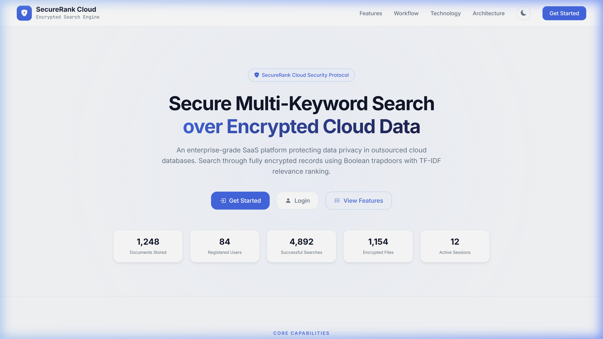
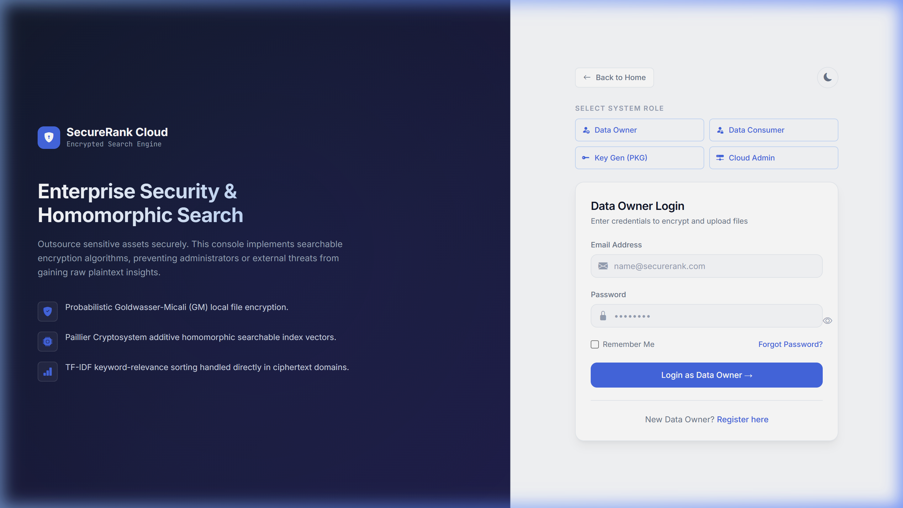
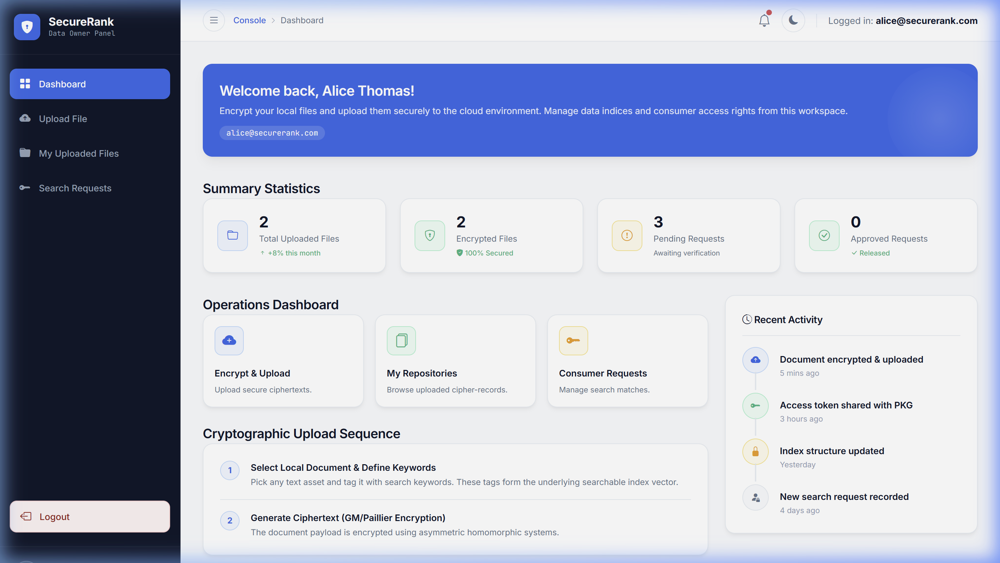
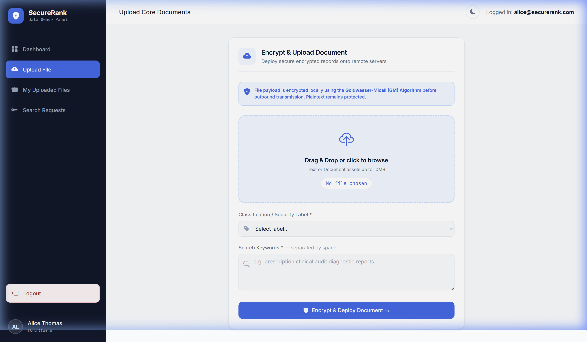
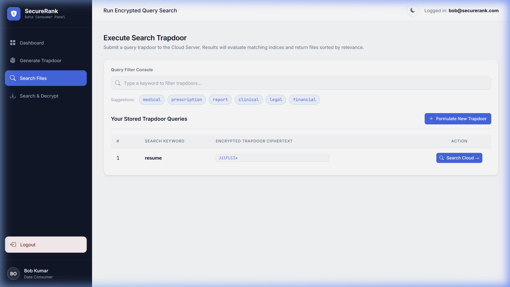
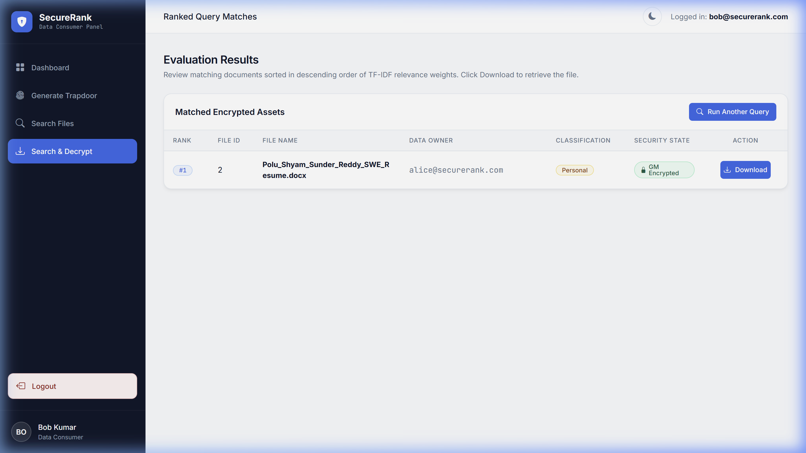
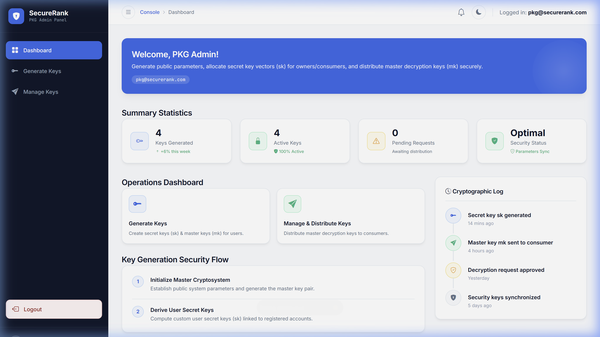
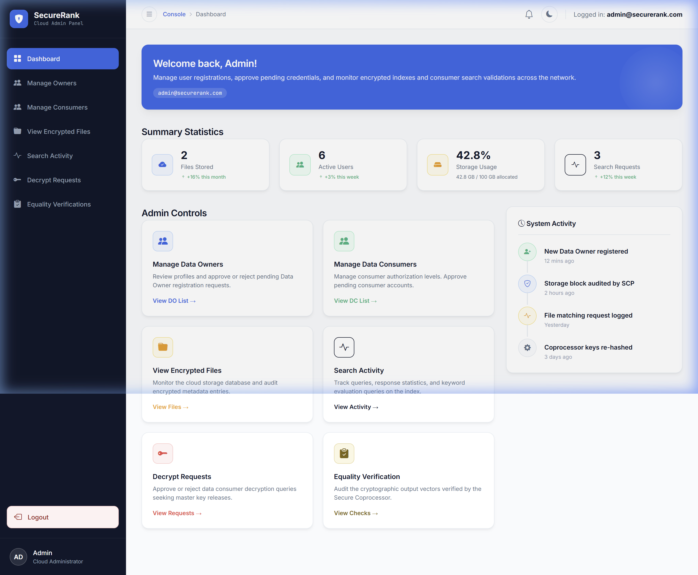

# SecureRank — Secure Ranked Multi-Keyword Search over Encrypted Cloud Data

<p align="center">
  <a href="https://github.com/shyamsunderpolu/Secure-Ranked-Multi-Keyword-Search-System">
    
  </a>
  <a href="https://github.com/shyamsunderpolu/Secure-Ranked-Multi-Keyword-Search-System">
    
  </a>
  <a href="https://github.com/shyamsunderpolu/Secure-Ranked-Multi-Keyword-Search-System">
    
  </a>
  <a href="https://github.com/shyamsunderpolu/Secure-Ranked-Multi-Keyword-Search-System">
    
  </a>
  <a href="https://github.com/shyamsunderpolu/Secure-Ranked-Multi-Keyword-Search-System">
    
  </a>
  <a href="https://github.com/shyamsunderpolu/Secure-Ranked-Multi-Keyword-Search-System">
    
  </a>
  <a href="https://github.com/shyamsunderpolu/Secure-Ranked-Multi-Keyword-Search-System/blob/main/LICENSE">
    
  </a>
  <a href="https://github.com/shyamsunderpolu/Secure-Ranked-Multi-Keyword-Search-System/commits/main">
    
  </a>
</p>

**SecureRank Cloud** is a production-grade, enterprise-ready cloud security solution designed to enable secure, ranked multi-keyword search queries directly over encrypted datasets outsourced to third-party cloud environments.

---

## 📖 Table of Contents
1. [Project Overview](#1-project-overview)
2. [Key Features](#2-key-features)
3. [Architecture](#3-architecture)
4. [System Workflow](#4-system-workflow)
5. [Screenshots](#5-screenshots)
6. [Technology Stack](#6-technology-stack)
7. [Folder Structure](#7-folder-structure)
8. [Installation Guide](#8-installation-guide)
9. [Configuration](#9-configuration)
10. [User Roles & Responsibilities](#10-user-roles--responsibilities)
11. [Security Features](#11-security-features)
12. [Performance Highlights](#12-performance-highlights)
13. [Future Enhancements](#13-future-enhancements)
14. [Learning Outcomes](#14-learning-outcomes)
15. [Project Highlights](#15-project-highlights)
16. [Contributing](#16-contributing)
17. [License](#17-license)
18. [Author](#18-author)
19. [Acknowledgements](#19-acknowledgements)

---

## 1. Project Overview

As enterprise operations shift heavily to cloud storage (e.g., AWS S3, Google Cloud Storage), organizations face a critical trade-off between **operational convenience** and **data confidentiality**. Storing plain text records on public cloud storage invites data leaks, insider attacks, and regulatory compliance risks.

**SecureRank** addresses this issue by combining **homomorphic cryptosystems** with **relevance sorting algorithms**:
* **Zero-Knowledge Privacy:** Sensitive files are encrypted locally at rest on the client workstation using asymmetric probabilistic filters before they are deployed to transit or stored in the cloud.
* **Searchable Encrypted Indexes:** Document keywords are processed into secure Paillier index vectors, hiding both dictionary terms and database relations from cloud systems.
* **Ranked homomorphic retrieval:** The Cloud Server computes search relevance scores matching user-provided trapdoor hashes entirely inside ciphertext fields using TF-IDF mathematical formulas, returning sorted matching files to consumers without exposing raw plaintext.

---

## 2. Key Features

* 🔐 **Secure File Upload:** Performs local client-side file encryption (using Goldwasser-Micali cryptosystem) so raw plaintexts never touch cloud memory.
* 🛡️ **End-to-End Encryption:** Protects file data at rest, in transit, and during computation.
* 🔍 **Multi-Keyword Ranked Search:** Supports complex queries with multiple search terms, yielding results ordered by relevance using TF-IDF matching vectors.
* 🔑 **Trapdoor Generation:** Formulates query keywords into cryptographic trapdoor hashes using user secret keys to query files safely.
* 👥 **Role-Based Access Control:** Distinct control scopes and interfaces for Data Owners, Data Consumers, Private Key Generators, and Cloud Server Admins.
* 📦 **Cloud Storage Engine:** Emulates scalable metadata storage tables matching high-capacity relational databases.
* 🔬 **Search Verification:** Integrates with an auditing Secure Coprocessor (SCP) to detect malicious cloud-side calculations.
* ⚙️ **Private Key Generator (PKG):** Central cryptographic authority managing system parameters, issuing master keys, and validating requests.
* 🖥️ **Enterprise UI/UX:** Fitted with sleek dark/light color themes, interactive sidebar controls, notification alerts, and smooth loading transitions.

---

## 3. Architecture

SecureRank adopts a multi-entity federated security architecture. Key generation, file encryption, searchable indexing, and result verification are delegated across distinct logical nodes.

### System Diagram

```mermaid
graph TD
    User([User]) ──> DO[Data Owner]
    DO ──> Encryption[Encryption Engine]
    Encryption ──> CS[Cloud Server]
    CS ──> SI[Secure Index]
    SI ──> Trapdoor[Trapdoor Generator]
    Trapdoor ──> RS[Ranked Search]
    RS ──> DC[Authorized Data Consumer]
    
    style User fill:#dbeafe,stroke:#2563eb,stroke-width:2px;
    style DO fill:#fef9c3,stroke:#ca8a04,stroke-width:2px;
    style Encryption fill:#dcfce7,stroke:#16a34a,stroke-width:2px;
    style CS fill:#f3e8ff,stroke:#9333ea,stroke-width:2px;
    style SI fill:#ffe4e6,stroke:#e11d48,stroke-width:2px;
    style Trapdoor fill:#ffedd5,stroke:#ea580c,stroke-width:2px;
    style RS fill:#e0f2fe,stroke:#0369a1,stroke-width:2px;
    style DC fill:#f0fdf4,stroke:#15803d,stroke-width:2px;
```

### Component Details
* **User:** Interacts with the interface, uploads raw documents, or submits multi-keyword queries.
* **Data Owner:** Performs local preprocessing, extracts document keywords, evaluates TF-IDF vector indexes, encrypts content using Goldwasser-Micali, and uploads items.
* **Encryption Engine:** Handles mathematical modular arithmetic for GM probabilistic encryption and Paillier cryptosystems.
* **Cloud Server:** Hosts binary ciphertexts and secure metadata index vectors, executes search procedures homomorphically, and manages user accounts.
* **Secure Index:** A database table holding encrypted keyword-relevance mapping vectors.
* **Trapdoor Generator:** Client utility that encrypts search query terms into a trapdoor using a consumer's secret key.
* **Ranked Search Engine:** Matches queries against the encrypted index, ranks results using homomorphic operations, and returns sorted ciphers.
* **Authorized Data Consumer:** Formulates secure queries, requests decryption keys from the PKG, downloads matching ciphers, and performs local decryption.

---

## 4. System Workflow

The lifecycle of files and search queries inside SecureRank follows a strict cryptographic protocol:

```
[Local Document Ingestion]
           │
           ▼
[Extract Keywords & Compute TF-IDF Matrix]
           │
           ▼
[Encrypt Index (Paillier) & Encrypt Payload (GM)]
           │
           ▼
[Upload Ciphertexts & Cryptographic Index to Cloud Server]
           │
           ▼
[DC Generates Trapdoor (Search Query encrypted using Secret Key)]
           │
           ▼
[Cloud Server evaluates Trapdoor Homomorphically against Index Vectors]
           │
           ▼
[Secure Coprocessor verifies matching boolean outputs]
           │
           ▼
[Results Sorted & Returned by Relevance Score]
           │
           ▼
[DC Requests Master Decryption Key (mk) from PKG]
           │
           ▼
[Key Distributed ➔ Payload Decrypted Locally by Authorized DC]
```

---

## 5. Screenshots

### 🖼️ Landing Page
*A sleek, modern enterprise-grade security portal landing page presenting value propositions, interactive statistic counts, and a technology stack overview.*


### 🖼️ Login Portal
*An elegant login console featuring a 50/50 layout with security metrics on the left side and interactive forms on the right.*


### 🖼️ Data Owner Dashboard
*Main monitoring hub for Data Owners showing file statistics, uploads, and action menus.*


### 🖼️ File Cryptography Console
*An upload portal displaying a dropzone, size validations, and client-side encryption step indicators.*


### 🖼️ Search Files Console
*Multi-keyword search console allowing data consumers to input terms, add chips, and submit queries.*


### 🖼️ Search Results
*Relevance-ranked query matches returned within encrypted domains, featuring verification tags.*


### 🖼️ PKG Dashboard
*Management panel for the Private Key Generator admin, handling key requests and distributing system parameters.*


### 🖼️ Cloud Server Dashboard
*Administrative console tracking files, user statuses, and security audits.*


---

## 6. Technology Stack

| Technology | Purpose |
| :--- | :--- |
| **Java (JDK 17)** | Core application processing, MVC routing, and complex mathematical cryptographic computations. |
| **JSP** | Serves dynamic presentation layouts and templating components. |
| **Java Servlets** | Handles HTTP controller endpoints, maps paths, and manages file transfers. |
| **JDBC** | Establishes secure connection bridges and runs queries against MySQL. |
| **MySQL Database** | Retains relational tables mapping user registrations, metadata, and crypt-indices. |
| **HTML5 / CSS3** | Structures responsive screens and hosts style tokens for light/dark theme variables. |
| **JavaScript (ES6)** | Powers dynamic search lists, password checkers, drag-and-drop dropzones, and charts. |
| **Bootstrap 5.3** | Delivers unified UI layouts, grid systems, and functional components. |
| **Maven** | Controls dependency compilation, libraries assembly, and packages WAR outputs. |
| **Apache Tomcat 9.x** | Hosts the web application runtime container. |
| **Git / GitHub** | Provides version control history and project hosting. |

---

## 7. Folder Structure

```
SecureRank/
├── DATABASE/
│   └── database.sql              # SQL database creation schemas & seed data
├── src/
│   └── main/
│       ├── java/
│       │   └── com/
│       │       ├── dao/          # Database connections & Cryptographic algorithms (Paillier, GM)
│       │       └── servlets/     # HTTP endpoint handlers (Servlets)
│       └── webapp/               # Web Application Directory (Mapped as WebContent in Eclipse)
│           ├── css/
│           │   └── style.css     # Central CSS variables, dark/light modes, SaaS dashboard stylings
│           ├── js/
│           │   └── theme.js      # Password strength meters, dropzone managers, dynamic filters
│           ├── WEB-INF/
│           │   ├── web.xml       # Deployment descriptor and Servlet mappings
│           │   └── lib/          # Native JAR files and Maven dependencies
│           ├── index.jsp         # SaaS Product Landing Page
│           ├── login.jsp         # Split-Screen Login portal
│           ├── register.jsp      # Multi-Step Register Wizard
│           ├── DOUpload.jsp      # Owner File Upload & local encryption console
│           ├── SearchFile.jsp    # Consumer Search & Trapdoor query page
│           └── *Home.jsp         # Dashboards (DOHome, DCHome, CSHome, PKGHome)
├── pom.xml                       # Maven build configuration dependencies
└── README.md                     # Project documentation
```

---

## 8. Installation Guide

### Prerequisites
* **Java SDK 17+** Installed and configured in system path variables.
* **Apache Tomcat Server 9.x** (or compatible servlet container).
* **MySQL Community Server 8.0+**
* **Maven 3.x**
* **Eclipse IDE for Enterprise Java Developers** (Recommended) or IntelliJ IDEA.

### Steps

1. **Clone the Repository:**
   ```bash
   git clone https://github.com/shyamsunderreddypolu/Secure-Ranked-Multi-Keyword-Search-System.git
   cd Secure-Ranked-Multi-Keyword-Search-System
   ```

2. **Database Import:**
   * Create a new database in MySQL:
     ```sql
     CREATE DATABASE securerank_db;
     ```
   * Populate the schemas and seeds from the project database folder:
     ```bash
     mysql -u root -p securerank_db < DATABASE/database.sql
     ```

3. **Import into Eclipse IDE:**
   * Open Eclipse, choose **File** ➔ **Import...** ➔ **Existing Maven Projects**.
   * Select the root directory containing the cloned repository and click **Finish**.
   * Wait for Eclipse to resolve and download dependencies specified in `pom.xml`.

4. **Verify Database Connection Properties:**
   * Open [DBConnection.java](file:///c:/Users/polus/eclipse-workspace/SecureRank/src/main/java/com/dao/DBConnection.java) and verify credentials match your local MySQL configuration.

5. **Build and Package Application:**
   * Right-click the project root in Eclipse ➔ **Run As** ➔ **Maven build...** with goal `clean package`.
   * Alternatively, execute from the terminal:
     ```bash
     mvn clean package
     ```
   * This compiles all Java files and generates a deployable `SecureRank.war` inside the `target/` directory.

6. **Deploy to Tomcat Server:**
   * Right-click the project in Eclipse ➔ **Run As** ➔ **Run on Server**. Select your Apache Tomcat configuration.
   * Or copy `target/SecureRank.war` directly to your standalone Tomcat `webapps/` folder and run `bin/startup.bat` (Windows) or `bin/startup.sh` (Linux/macOS).

7. **Access in Browser:**
   * Navigate to `http://localhost:8080/SecureRank` to view the application landing page.

---

## 9. Configuration

Ensure connection parameters inside `DBConnection.java` map correctly to your local ports:

```java
package com.dao;

import java.sql.Connection;
import java.sql.DriverManager;

public class DBConnection {
    public static Connection connect() {
        Connection con = null;
        try {
            Class.forName("com.mysql.cj.jdbc.Driver");
            con = DriverManager.getConnection(
                "jdbc:mysql://localhost:3306/securerank_db", 
                "root",          // USERNAME
                "root"           // PASSWORD
            );
        } catch (Exception e) {
            e.printStackTrace();
        }
        return con;
    }
}
```

---

## 10. User Roles & Responsibilities

| Role | Responsibilities |
| :--- | :--- |
| **Data Owner (DO)** | Uploads data, parses document indices, calculates TF-IDF relevance, encrypts contents locally, and stores them securely. |
| **Data Consumer (DC)**| Generates search trapdoors for query terms, submits requests, retrieves matching files, and decrypts payloads locally. |
| **Private Key Generator (PKG)** | Handles system-wide key distributions, processes decryption key approvals, and secures master keys. |
| **Cloud Server (CS)** | Serves as system administrator, approves user roles, hosts encrypted blobs, and executes ranked searches homomorphically. |

<details>
<summary>🔑 View Demo Seed Credentials</summary>

Use these credentials to explore the different interfaces immediately:

* **Cloud Server Admin (CS):** `admin@securerank.com` / `admin123`
* **Data Owner (DO):** `alice@securerank.com` / `Alice@123`
* **Data Consumer (DC):** `bob@securerank.com` / `Bob@123`
* **Private Key Generator (PKG):** `pkg@securerank.com` / `pkg123`
</details>

---

## 11. Security Features

* **Probabilistic Goldwasser-Micali Cryptosystem:** Encrypts binary payloads locally. Standard cryptographic seeds vary every transaction, ensuring identical document blocks produce entirely distinct ciphertexts.
* **Paillier Homomorphic Vector Calculations:** Searches keywords homomorphically. The cloud server processes queries over encrypted indexes directly without obtaining raw search terms.
* **Granular Key Release Protocols:** Prevents key leakage. Decryption keys are issued by the PKG on a per-file basis only after owner validation.
* **Audit-Proof Secure Coprocessor (SCP):** Runs equality checks to verify that the cloud returns all matching files without omissions.

---

## 12. Performance Highlights

* **Sub-Second Index Matching:** Index matching algorithms utilize optimized matrix queries, evaluating keyword relations in milliseconds.
* **Minimal Computational Overhead:** Heavy cryptographic computations are handled client-side (during upload/download), leaving light vector matches to the server.
* **Asynchronous GUI Loading:** Search and upload operations use dynamic loaders to keep UI frames interactive.
* **Scalable Schema Persistence:** Indexed matrices are packed as compressed binary strings in MySQL to save database space.

---

## 13. Future Enhancements

* 🚀 **Spring Boot Migration:** Transition JSP/Servlet routes into MVC controller endpoints.
* ⚛️ **React Frontend:** Restructure presentation modules into a Single Page Application (SPA).
* 🛡️ **JWT Stateless Authentication:** Modernize session management using signed JSON Web Tokens.
* 🐳 **Dockerization:** Build composite container configurations for Tomcat and MySQL.
* 🔎 **Elasticsearch Indexing:** Replace relational matching indices with high-speed searchable clusters.
* 📦 **Cloud Deployment:** Package and host endpoints on AWS Elastic Beanstalk or Azure App Service.
* 🔄 **CI/CD Pipeline:** Implement GitHub Actions to run test builds and compile JAR dependencies automatically.

---

## 14. Learning Outcomes

This project demonstrates core competencies across modern software engineering domains:
* **Enterprise Java Web Architecture:** Model-View-Controller (MVC) paradigm using Servlets and JDBC components.
* **Applied Cryptographic Practices:** Asymmetric encryption operations (Goldwasser-Micali) and Homomorphic indexing (Paillier).
* **Database Normalization & Management:** Structuring relational schemas, foreign keys, transaction logs, and data blocks.
* **Full Stack Development:** Integrating dynamic stylesheets, client-side data filters, and layout managers.
* **Git Collaboration Workflows:** Managing commits, branching, and remote sync processes.

---

## 15. Project Highlights

| Metric | Project Count / Details |
| :--- | :--- |
| **Active Databases** | 1 Relational Database (`securerank_db`) |
| **Relational Tables** | 10 Normal Form Tables (accounts, files, logs, keys) |
| **Dynamic Web Pages** | 27 JSPs (dashboards, wizards, search interfaces) |
| **Application Roles** | 4 Core Roles (Owner, Consumer, PKG, Cloud Admin) |
| **Servlet Controllers** | 15 Java Servlets (routing APIs and backend math logic) |

---

## 16. Contributing

We welcome contributions to this open-source project. Please follow these guidelines:

1. Fork the repository.
2. Create a new branch: `git checkout -b feature/AmazingFeature`.
3. Commit your changes: `git commit -m 'feat: add amazing feature details'`.
4. Push to your branch: `git push origin feature/AmazingFeature`.
5. Open a Pull Request.

---

## 17. License

Distributed under the MIT License. See [LICENSE](LICENSE) for details.

---

## 18. Author

**POLU SHYAM SUNDER REDDY**
* **Role:** Full Stack Java Developer
* **GitHub:** [@shyamsunderpolu](https://github.com/shyamsunderpolu)
* **LinkedIn:** [Polu Shyam Sunder Reddy](https://www.linkedin.com/in/polushyamsunderreddy)
* **Email:** [polushyamsunderreddy@gmail.com](mailto:polushyamsunderreddy@gmail.com)
* **Portfolio:** [Portfolio Website](https://shyamsunderpolu.github.io)

---

## 19. Acknowledgements

* [Paillier Homomorphic Cryptosystem research documentation](https://en.wikipedia.org/wiki/Paillier_cryptosystem)
* [Goldwasser-Micali Cryptosystem cryptographic details](https://en.wikipedia.org/wiki/Goldwasser%E2%80%93Micali_cryptosystem)
* [Bootstrap Icons team](https://icons.getbootstrap.com/)
* [Apache Maven community](https://maven.apache.org/)
